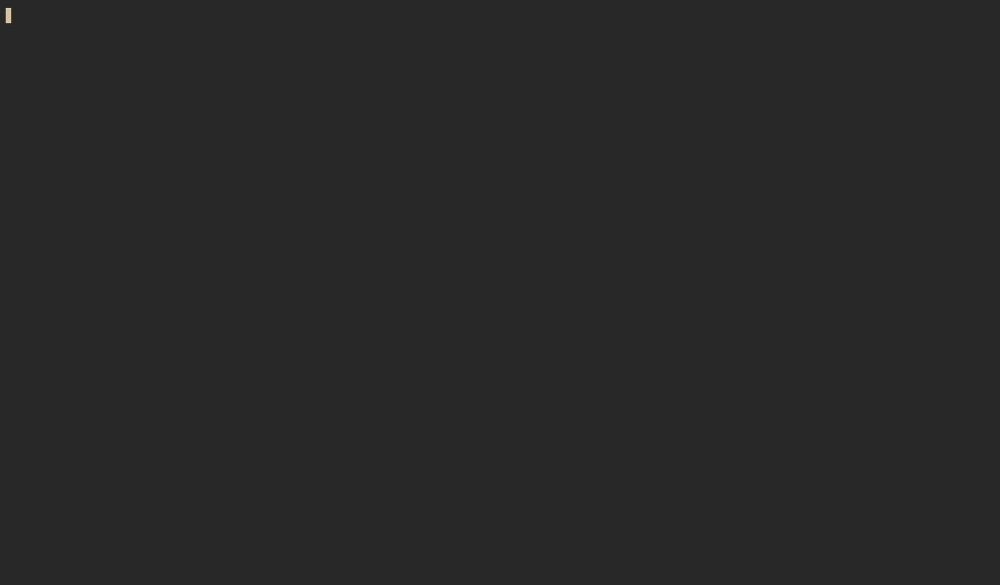

# fibrous.nvim

A declarative, component-based, React-like UI framework for Neovim plugins. It
brings a VDOM, hooks, and subtree reconciliation to Neovim UI development, and
renders component trees inline: text + extmarks in one unmodifiable buffer, with
a CSS-like box model, cursor-driven hover/activation, and real editable floats
only where a native buffer is needed (text inputs, raw buffers).

## Docs and live demo

As a showcase of what this library can do, the documentation site is created in
fibrous itself, and runs in your browser using a WASM-compiled version of
Neovim! Access it [here](https://mbrea-c.github.io/fibrous-docs/). There are
interactive, hot-reloadable examples to play around with.



## Examples

Runnable sample UIs live in [`examples/`](examples/). They open in a clean,
isolated Neovim (no user config or other plugins):

```sh
make example              # opens Neovim; then :Examples / :Example <name>
make example EX=counter   # opens and runs one example directly
```

See [`examples/README.md`](examples/README.md) for the full list.

## Jump to widgets with flash.nvim

`require("fibrous.targets").targets(opts?)` returns every interactive element
currently on screen across **all** live mounts and their windows/floats as pure
geometry, shaped like a [flash.nvim](https://github.com/folke/flash.nvim) match.

This is optional and you don't need `flash.nvim` to use this library. If an user
wants to take advantage of this for easier navigation, they can set a global
keybind in their own config:

```lua
-- bind this to a <C-...> key, NOT a <Space>-leader chord: fibrous maps
-- <Space>/<CR>/<Tab>/i/a/d/c/v… buffer-locally, so a <Space> leader is
-- swallowed inside a fibrous window.
vim.keymap.set({ "n", "v" }, "<C-f>", function()
  require("flash").jump({
    -- wrap=true labels matches before the cursor too (else forward-only in
    -- the current window); let flash's default labeler assign the labels.
    search = { multi_window = true, wrap = true, incremental = false, max_length = 0 },
    matcher = function(win)
      local Pos = require("flash.search.pos")
      local out = {}
      for _, t in ipairs(require("fibrous.targets").targets({ winid = win })) do
        out[#out + 1] = { win = win, pos = Pos(t.pos), end_pos = Pos(t.end_pos) }
      end
      return out
    end,
  })
end)
```

`flash` jumps the cursor to the chosen widget. `opts` allows optional filters by
`winid`, `kinds` (e.g. `{ "button", "checkbox" }`), and an arbitrary
`predicate`. See the [API reference](https://mbrea-c.github.io/fibrous-docs/)
for the full shape.

The registry spans every mount, so any fibrous UI (this one, third-party
plugins, anything) becomes flash-navigable for free, with no cooperation from
the app.

## Nix

The flake packages the plugin and wraps the dev entry points (no local `nvim`
needed):

```sh
nix run .                                     # examples browser (same as .#example)
nix run .#example -- counter                  # open one example directly
nix run .#test                                # the full test suite
nix run .#test -- tests/inline/host_spec.lua  # one spec file
nix run .#bench                               # inline host benchmarks (BENCH_N=… env)
nix flake check                               # suite as a sandboxed check
```

Apps run against the flake's snapshot of the source (i.e. what's committed or
staged). Use the `make` targets against the working tree during development.

The plugin itself is also exposed as a flake output: `packages.<system>.default`
(built with `vimUtils.buildVimPlugin`).
